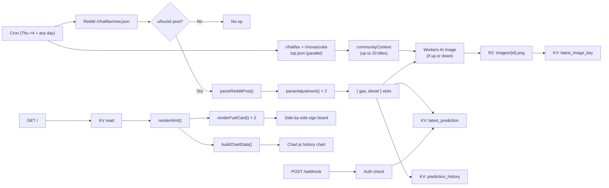

# Architecture

## System Overview

```
┌─────────────────────────────────────────────────────────┐
│                  Cloudflare Worker                       │
│                   (src/index.js)                         │
│                                                          │
│  ┌─────────────┐   ┌──────────────┐   ┌─────────────┐  │
│  │  scheduled()│   │   fetch()    │   │   fetch()   │  │
│  │  Cron ×4   │   │   GET /      │   │  POST /     │  │
│  │  (any day) │   │  Website     │   │  webhook    │  │
│  └──────┬──────┘   └──────┬───────┘   └─────┬───────┘  │
│         │                 │                  │           │
│         ▼                 ▼                  ▼           │
│  ┌─────────────┐   ┌──────────────┐   ┌─────────────┐  │
│  │Reddit fetch │   │  KV read     │   │  Auth +     │  │
│  │r/halifax    │   │  + render    │   │  KV write   │  │
│  │/new.json    │   │  HTML        │   │  (override) │  │
│  └──────┬──────┘   └──────────────┘   └─────────────┘  │
│         │                                                │
│         ▼                                                │
│  ┌─────────────┐                                        │
│  │parseReddit  │ ← markdown table (primary)             │
│  │Post()       │ ← free-text fallback (legacy)          │
│  │{gas,diesel} │                                        │
│  └──────┬──────┘                                        │
│         │                                                │
│         ▼                                                │
│  ┌─────────────┐   ┌──────────────┐                    │
│  │Workers AI   │   │  KV write    │                    │
│  │flux-1-      │──▶│  latest +    │                    │
│  │schnell      │   │  history     │                    │
│  └──────┬──────┘   └──────────────┘                    │
│         │                                                │
│         ▼                                                │
│  ┌─────────────┐                                        │
│  │ R2 bucket   │                                        │
│  │ store image │                                        │
│  └─────────────┘                                        │
└─────────────────────────────────────────────────────────┘
```

## Mermaid Diagram



## Diagrams

- Excalidraw: `diagrams/architecture.excalidraw`
- Draw.io: `diagrams/architecture.drawio`

## Cron Schedule

Four Thursday windows to catch /u/buckit's post regardless of when it's published. The cron also fires on demand — the 7-day look-back window means **interrupter clause posts** (mid-week emergency rate adjustments) are caught on any day:

| UTC | Halifax (AST/ADT) |
|-----|-------------------|
| 12:00 | 9:00 AM |
| 14:00 | 11:00 AM |
| 16:00 | 1:00 PM |
| 18:00 | 3:00 PM |

Each run is idempotent — `last_processed_post_id` in KV prevents double-processing. Posts within the last **7 days** are eligible (not just 24 hours) to handle interrupter clauses on any weekday.

## Reddit Post Format

/u/buckit posts a **markdown table** in the selftext:

```
|Type|Adjustment|New Min Price|
:--|:--|:--|
|Regular| UP 3.6 |162.1|
|Diesel| DOWN 0.7 |154.4|
May be +/- 0.1
```

- `Type`: `Regular`, `Gas`, `Gasoline`, or `Diesel` (case-insensitive)
- `Adjustment`: `UP 3.6`, `DOWN 0.7`, or `NO CHANGE` — parsed by `parseAdjustment()`
- `New Min Price`: in **cents** (162.1 → $1.621/L). Values > 10 are auto-divided by 100.
- Trailing free-text lines become `notes`

A **free-text fallback** handles older posts without a markdown table.

## Data Model

### Prediction object (stored in KV)

```json
{
  "gas": {
    "direction": "up" | "down" | "no-change" | null,
    "adjustment": 3.6,
    "price": 1.621
  },
  "diesel": {
    "direction": "down" | "up" | "no-change" | null,
    "adjustment": 0.7,
    "price": 1.544
  },
  "notes": "May be +/- 0.1",
  "source": "reddit" | "webhook",
  "post_id": "1q7msj6",
  "post_url": "https://www.reddit.com/r/halifax/comments/...",
  "reddit_title": "Gas prices this week",
  "updated_at": "2026-02-21T14:00:00.000Z",
  "image_key": "images/1q7msj6.png"
}
```

Either `gas` or `diesel` may be `null` if not present in the post.

## Storage

### KV Namespace: `PREDICTIONS`

| Key | Type | Description |
|-----|------|-------------|
| `latest_prediction` | JSON | Current prediction + metadata |
| `prediction_history` | JSON array | Last 10 predictions, newest first |
| `latest_image_key` | string | R2 key of latest AI image |
| `last_processed_post_id` | string | Dedup: ID of last processed Reddit post |

### R2 Bucket: `IMAGES`

| Key | Description |
|-----|-------------|
| `images/{post_id}.png` | AI-generated PNG |

### Workers AI

Model: `@cf/black-forest-labs/flux-1-schnell` (Flux 1 Schnell — fast image generation)
Binding: `env.AI`
Free tier: included (Cloudflare AI free plan)

Images are only generated when direction is `"up"` or `"down"` — not for `"no-change"`.

#### Image generation pipeline

1. **Trigger** — `scheduled()` runs `fetchBuckitPost(env)` and `fetchCommunityContext(env)` in parallel via `Promise.all`. After parsing the prediction, `generateAndStoreImage(postId, direction, communityContext, env)` is called only when `direction` is `"up"` or `"down"`.
2. **Community context** — `fetchCommunityContext(env)` fetches the top 10 posts from both r/halifax and r/novascotia (`/top.json?t=week&limit=10`) in parallel via `Promise.allSettled`. If one subreddit fails, the other's titles are still used. If both fail, the image prompt falls back to a season-based context.
3. **Prompt** — Built by `buildImagePrompt(direction, postId, communityContext)`:
   - Direction label: `"going UP"` or `"going DOWN"`
   - Mood: despair/crying for up; celebration/relief for down
   - **Community context** (when available): `"This week in Halifax and Nova Scotia: [title1]; [title2]; ..."` — up to 20 titles, each truncated to 60 chars. Whatever Halifax/NS are talking about that week (potholes, storms, local events) becomes the backdrop.
   - **Season fallback** (when community context is empty): weather context from `getSeason(date)` (winter/spring/summer/fall)
   - Style: funny editorial cartoon meme, vibrant flat design, work-safe, Canadian humour, no text in image
   - Seed context: first 8 chars of the Reddit post ID (for deterministic variation)
4. **Generation** — `env.AI.run('@cf/black-forest-labs/flux-1-schnell', { prompt, num_steps: 4 })`
5. **Storage** — Returns base64; decoded to `Uint8Array` and stored in R2 at `images/{postId}.png` with `contentType: image/png`
6. **KV reference** — `latest_image_key` KV entry is updated to `images/{postId}.png`
7. **Serving** — `GET /images/:key` reads the R2 object and streams it with the stored content type

The image key is also embedded in the prediction JSON as `image_key` and used for Open Graph `og:image` meta tags.

## Reddit Detection

Post must match all criteria:
- `post.author.toLowerCase() === 'buckit'` (case-insensitive — handles both `buckit` on r/halifax and `Buckit` on r/NovaScotia)
- Title contains: `gas`, `gasoline`, `diesel`, `fuel`, `price`, or `interrupter`
- `created_utc` within last **7 days**
- Not already processed (KV dedup)

Non-matching posts are completely ignored.

## Community Context Fetch

In parallel with `fetchBuckitPost()`, `fetchCommunityContext(env)` fetches:

- `GET https://www.reddit.com/r/halifax/top.json?t=week&limit=10`
- `GET https://www.reddit.com/r/novascotia/top.json?t=week&limit=10`

Both run concurrently via `Promise.allSettled` — if one subreddit is unavailable, the other's titles are still used. Up to 20 titles (10 per subreddit) are extracted and passed into `buildImagePrompt()` to make the meme image reflect what Halifax/NS are actually talking about that week.
